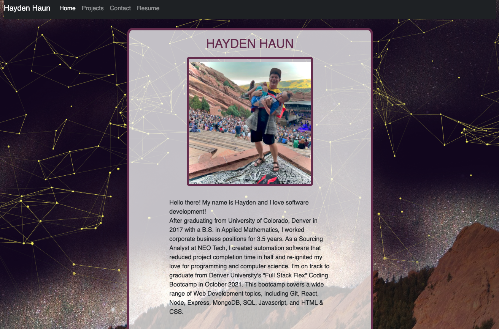

# Portfolio with React

LIVE URL: https://offline-budget-app-hh.herokuapp.com/

REPOSITORY: https://github.com/Hayden-Haun/React-Portfolio

## Table of Contents

- [Description](#description)
- [Installation](#installation)
- [Contributions](#contributions)
- [Usage](#usage)
- [Tests](#tests)
- [Technologies Used](#Technologies)
- [Credits](#credits)
- [Questions](#questions)

## Description

This is a rough-draft of my portfolio made with React. Practicing DOM rendering with React Basics.

## Installation

    npm i

## Contributions

    Contact the owner

## Usage

    Launch Server: node server.js

## Tests

    none

## Technologies Used

    React.js, Bootstrap, HTML, CSS, Javascript

## Credits

    Hayden Haun
